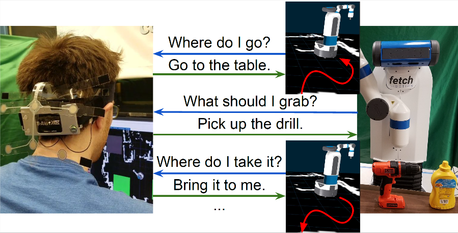

# Task Level Hierarchical System for BCI-enabled Shared Autonomy

#### Iretiayo Akinola, Boyuan Chen, Jonathan Koss, Aalhad Patankar, Jacob Varley  and Peter Allen

### Abstract
This paper describes a novel hierarchical system for shared control of a humanoid robot. Our framework uses a low-bandwidth Brain Computer Interface (BCI) to interpret electroencephalography (EEG) signals via Steady-State Visual Evoked Potentials (SSVEP). This BCI allows a user to reliably interact with the humanoid. Our system clearly delineates between autonomous robot operation and human-guided intervention and control.  Our shared-control system leverages the ability of the robot to accomplish low level tasks on its own, while the user assists the robot with high level directions when needed. This partnership prevents fatigue of the human controller by not requiring continuous BCI control to accomplish tasks which can be automated. We have tested the system in simulation and in real physical settings with multiple subjects using a Fetch mobile manipulator. Working together, the robot and human controller were able to accomplish tasks such as navigation, pick and place, and table clean up.

### Video

### Links

This work was published at Humanoids 2017. [Paper PDF](http://www.cs.columbia.edu/~allen/PAPERS/Humanoids_2017.pdf)

